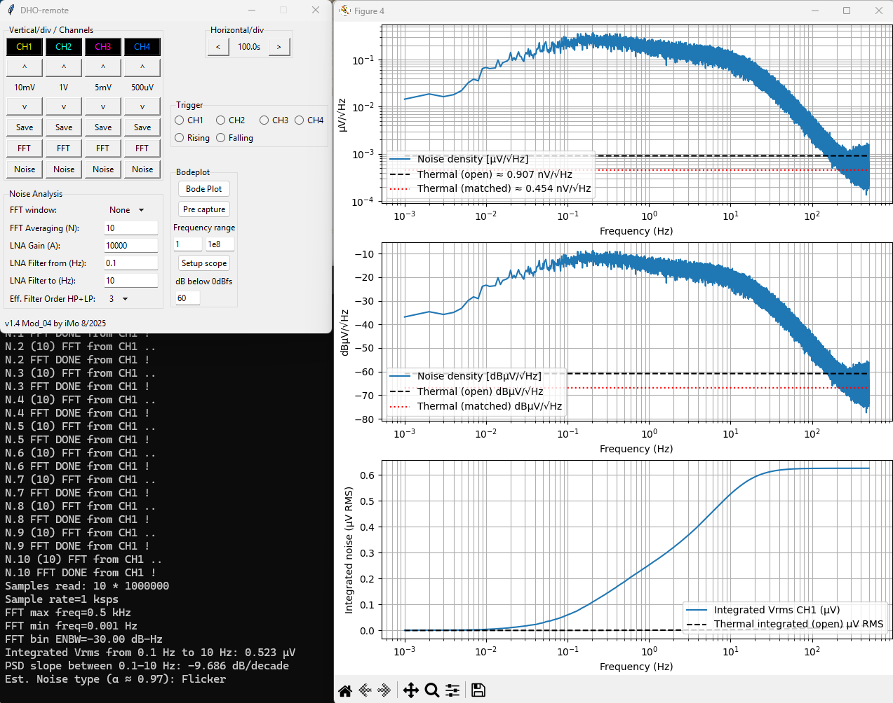

# dho-remote
Control your digital oscilloscope remotely. Create FFT and Bode and Noise Analysis plots and save raw data.
************************************************************************************************************

I spent a couple of days with implementing a simple "Noise Analysis" into this tool and here you are:
It works under Win11 as well as under Linux (ie. Armbian in a cheapo TvBox).
The original Bode functionality shall work as well (not tested yet).

Below you may see a typical results you may expect.

Some notes to the newly implemented "Noise Analysis" inputs:
*************************************************************
```
FFT windows:               for Noise it is recommended the None (Rectangular)

FFT Averaging (N):         you may enter the number of FFTs averaged, 50

LNA Gain (A):              here you enter the gain of your LNA as an integer (not dB), like 10000

LNA Filter from (Hz):      the HPF's -3db corner frequency, like 0.1

LNA Filter to (Hz):        the LPF"s -3dB corner frequency, like 10

Eff. Filter Order HP+LP:   this might be a controversal topic.. 

    It is the "sum" of HPF and LFP orders, like 2+2=4..
    Based on that you get aprox Shape Factor of the by HPF and LPF Bandpass. 
    For SFs used see the source.
    There are numbers like 3.5 to choose from - that is why it is called "Effective" as based
    on the actual design the roll-off may not follow the "ideal HPFs and LPFs" roll-offs.
```
****************************************************************************************

The rigol driver is set for reading in 1.000.000 chunks, but you may set almost any number of points
in the scope. It affects the speed it reads the data from the scope via LAN (aprox 3secs/10mil).

Also mind the "Save" button saves the "actual scope's samples buffer" into a .csv file, for example
1 million samples take aprox 50MB of storage on your PC..

The Noise Analysis outputs graphs and an info into the command line, like:

```
..
N.9 FFT DONE from CH1 !
N.10 (10) FFT from CH1 ..
N.10 FFT DONE from CH1 !
Samples read: 10 * 25000000
Sample rate=2500 ksps
FFT max freq=1250 kHz
FFT min freq=0.1 Hz
FFT bin ENBW=-10.00 dB-Hz
Integrated Vrms from 0.1 Hz to 10 Hz: 0.520 µV 
PSD slope between 0.1–10 Hz: -8.916 dB/decade
Est. Noise type (a ˜ 0.89): Flicker
..
```

The alpha (in the 1/f^alpha) is calculated via PSD as the slope of lin. interpolation inside the Bandpass.
So -10dB via a frequency decade gives you slope = -1.0, and the alpha = 1.0.
It estimates the type of noise as well (see the source).
For somehow good results the bandwidth of the Bandpass shall be at least 2 decades.

The "Integrated Vrms" is typically a little bit lower compared to the oscilloscope's AC.RMS readings.

You should set the vertical resolution and horizontal resolution and enter the Noise parameters.
By clicking on Noise button it starts to sample via Single Shot (the waveform appears on the display,
for example, with set Horizontal/div=10secs after 50secods) and then it reads the data off the scope
via LAN and makes the single FFT math (and continues in a loop).
Note: doublecheck your Trigger settings, otherwise it will not start with sampling!
After N loops it creates the results as described above.

The Thermal noise levels in the graphs are for an ideal 50ohm resistor at 25C (an example only).

Note: Mind that when you set for example Horizontal/div=100secs and N = 100
you will wait aprox 100800 seconds (28 hours) for the resulting graphs :)
So running the tool on an Rpi or on a small linux box (instead on your 96 core ThreadRipper)
might be a good idea.
The next step could be to replace the scope with a small sampling box as well..



Regards.
by Igor-M aka iMo 2025/09/01


# Update log
* V1.5
1. Added "Noise Analysis" for 1/f like noises types
* V1.4
1. Harmonic filtering improved. Now only local maxima in the spectrum on CH1 are used.
2. Auto setup now tries to set the timebase such that multiple periods are captured
3. Demo mode added. No scope needed: python dho-remote.py -d examples/LRC.bplt
4. Installation instruction added here. 
* V1.3
1. Loopgain analysis added (argument --loopgain)
2. FFT window selection menu added
3. Hann window added
4. Selection algorithm for Bode points optimized
* V1.2
1. Auto setup added
2. Trace colors now match the scope
* V1.1
1. corrected max selection when using multiple captures
2. Fixed phase display from radian to degrees.
